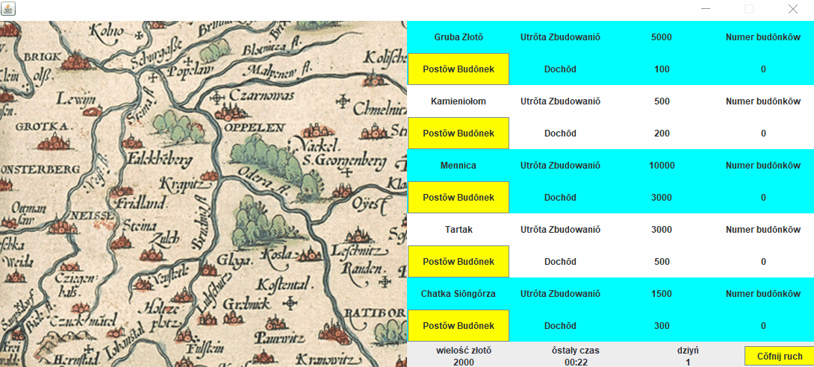

# Simple Game
A simple strategy game. The game allows you to place buildings on the map (mints, gold mines, woodcutter's huts,
 sawmills and quarries). The starting amount of gold is 2000 units.
 The costs of individual buildings are: Mint - 10,000, Gold Mine - 5,000, Chatka Drwala - 1,500, 
 Sawmill - 3,000, Quarry - 500. Buildings generate income: Mint - 3,000, Gold Mine - 100, Chatka Drwala - 300, 
 Sawmill - 500, Quarry - 200. Additional rules are: to create Gold Mines you need a Sawmill, 
 to create Mints you need a Lumberjack's Hut, to create a Sawmill you need a Quarry. 
 Buildings generate income after one day (in the game, a day lasts 45 seconds).
The game has an interface that communicates using the Ślůnska godka.
The game has a button that undoes the construction of buildings.
The game implements memento and template method design patterns.

## Operation of the game
